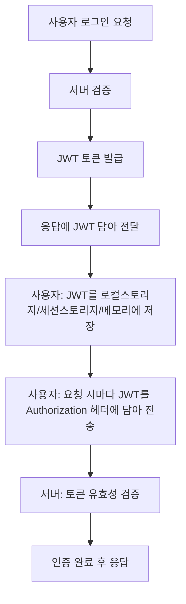
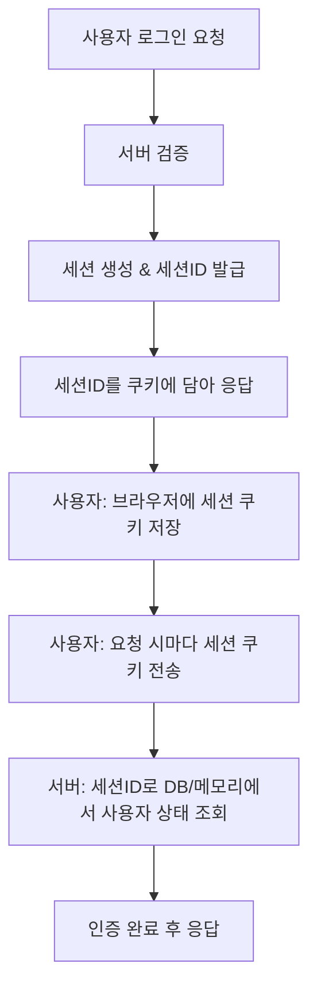

## 🪪 JWT 기반 인증 흐름 (Stateless)

## 🔑 세션 기반 인증 흐름

## 세션 기반 vs JWT 기반 인증 비교

| 특징         | 세션 기반 인증                                   | JWT 기반 인증                                        |
| :----------- | :----------------------------------------------- | :--------------------------------------------------- |
| **상태 관리**  | 서버에서 세션 상태를 관리 (Stateful)             | 서버에서 상태를 관리하지 않음 (Stateless)            |
| **확장성**     | 서버 확장에 어려움 (세션 동기화 필요)            | 서버 확장에 용이 (각 요청이 독립적)                 |
| **보안**       | 세션 하이재킹, 고정 세션 공격 위험               | 토큰 탈취 시 위험, 서명으로 위변조 방지              |
| **모바일 앱**  | 쿠키 사용으로 모바일 앱에서 구현 복잡            | 헤더에 토큰 포함으로 모바일 앱에 적합                |
| **CORS**     | 쿠키 사용 시 CORS 문제 발생 가능                 | 토큰 사용으로 CORS 문제 해결 용이                    |
| **오버헤드**   | 서버에 세션 저장으로 인한 메모리/DB 오버헤드     | 토큰 길이로 인한 네트워크 오버헤드                   |
| **주요 사용처** | 전통적인 웹 애플리케이션 (SSR)                   | SPA, 모바일 앱, 마이크로서비스 (API 통신)            |